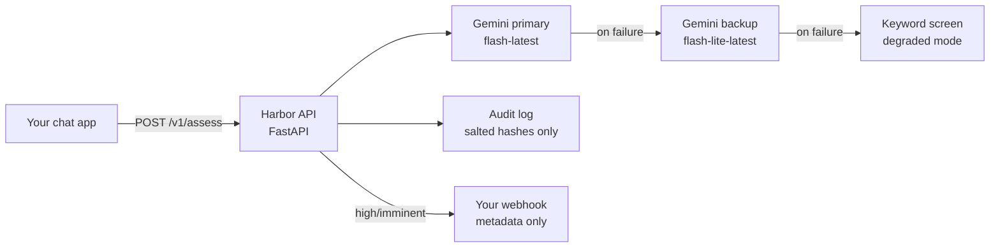

<!--
  README.md
-->

<p align="center">
  <!-- BADGES:START -->
  <a href="#"></a>
  <a href="#"></a>
  <a href="#"></a>
  <a href="#"></a>
  <a href="#"></a>
  <a href="#"></a>
  <!-- BADGES:END -->
</p>

# harbor

Author: Saina Kakkar

### Project Description
Harbor is a drop-in safety and compliance layer for AI chat apps.

California SB 243 (effective Jan 1, 2026) requires every operator of a
companion chatbot to maintain a crisis-detection protocol, refer at-risk
users to crisis services, publish the protocol, and (from July 2027) file
annual referral reports. This applies to small apps too. The liability sits
with the **app operator**, and violations carry a private right of action at
$1,000 each. Most small AI apps have nothing in place.

Harbor is one API call per user turn.

## What's Inside

| Surface | Path |
|---|---|
| Landing page ($49 audit / $29 mo API) | `GET /` |
| Live demo playground | `GET /demo` |
| Compliance dashboard | `GET /dashboard` |
| API docs (auto) | `GET /docs` |
| Health check | `GET /health` |
| Assess a turn | `POST /v1/assess` |
| SB 243 report | `GET /v1/compliance/report?year=2026` |
| Ops stats | `GET /v1/stats?days=14` |

## The Assess Endpoint

You send the conversation and some session context:

```bash
curl -X POST http://localhost:8000/v1/assess \
  -H "Content-Type: application/json" \
  -H "X-API-Key: sk_live_x" \
  -d '{
    "conversation_id": "conv_123",
    "messages": [
      {"role": "user", "content": "..."},
      {"role": "assistant", "content": "..."}
    ],
    "user_locale": "US",
    "user_is_minor": false
  }'
```

The request also accepts `session_started_at` and `last_break_reminder_at`
(unix timestamps, used for the minor break-reminder timing) and an
`escalation_webhook` that overrides the server-wide one per call.

You get back:

- `risk_level`: one of `none`, `low`, `moderate`, `high`, `imminent`. This
  comes from Gemini structured output and it is trajectory-aware, meaning it
  looks at where the conversation is going, not one message in isolation. A
  joke like "this homework is killing me" does not trigger a referral.
- `recommended_action` and locale-appropriate `crisis_resources`
- `referral_issued`: at moderate risk and above, the user is shown crisis
  service referrals, and this flag records that for the compliance report
- `escalation_triggered`: at `high` or `imminent`, Harbor fires your webhook
  with metadata only, never message content
- `minor_protections` (when `user_is_minor` is true): the SB 243 §22602 AI
  disclosure requirement, plus `break_reminder_due` computed from the
  3-hour timer, with ready-to-show reminder text
- `model`, `degraded`, `tenant`: what actually ran, explained below

## Architecture



The audit log stores a salted conversation hash and assessment metadata. It
never stores message content or PII. That is what SB 243's report format
requires anyway, and it means Harbor cannot become a data liability for the
apps that use it.

## Running Locally

1. **Set up the environment:**

   ```bash
   python3 -m venv .venv && .venv/bin/pip install -r requirements.txt
   ```

2. **Add your Gemini key** (without it, Harbor falls back to a conservative keyword mode):

   ```bash
   export GEMINI_API_KEY=...   # from aistudio.google.com
   ```

3. **Start the server:**

   ```bash
   .venv/bin/uvicorn main:app --reload   # http://localhost:8000
   ```

## Configuration Reference

Everything is optional and set through environment variables:

| Variable | Default | What it controls |
|---|---|---|
| `GEMINI_API_KEY` | unset | Enables model-based assessment; keyword fallback without it |
| `GEMINI_MODEL` | `gemini-flash-latest` | Primary assessment model |
| `GEMINI_BACKUP_MODEL` | `gemini-flash-lite-latest` | Tried when the primary fails |
| `GEMINI_TIMEOUT_MS` | `8000` | Per-request model deadline |
| `HARBOR_API_KEYS` | unset | `"acme:sk_live_x,beta:sk_live_y"`; unset = open dev mode |
| `HARBOR_FAIL_MODE` | `closed` | `closed` returns 503 on blind outages, `open` returns degraded 200 |
| `HARBOR_MONTHLY_CAP` | `10000` | Assessments per tenant per month |
| `HARBOR_DEMO_RPH` | `30` | Demo rate limit per hour per IP |
| `HARBOR_ALLOW_DEMO` | `1` | `0` disables keyless demo traffic entirely |
| `HARBOR_ESCALATION_WEBHOOK` | unset | Called at high/imminent risk (metadata only) |
| `HARBOR_DB` | local file | SQLite path for the audit log |
| `HARBOR_HASH_SALT` | unset | Salt for conversation hashes |

## What Happens When the Model Is Down

This was the design question I spent the most time on. Every `/v1/assess`
response carries `model` (the engine that actually ran), `degraded` (true
means a keyword screen ran, not a model), and `tenant`, so you always know
what you got:

| Status | Meaning | Integrator action |
|---|---|---|
| 200, `degraded: false` | Gemini (primary or backup) assessed the turn | trust the result |
| 200, `degraded: true` | models unreachable, keyword screen **found risk** | show the referral, treat as high |
| 503 `detection_unavailable` | models unreachable, keyword screen found nothing. Harbor will not report a false "none" | retry with backoff (`Retry-After: 30`) or queue |
| 429 | demo rate limit or tenant monthly cap | back off / upgrade |
| 401 | invalid API key (wrong keys are never downgraded to demo) | fix credentials |

I considered making outages return a quiet `risk: "none"`, which would keep
every integrator happy. I decided against it. A crisis detector that reports
"no risk" while it is not actually looking is worse than one that admits it
is down. If your integration cannot handle retries, set
`HARBOR_FAIL_MODE=open` and you get `200 + degraded: true + risk "none"`
instead of the 503, but then you own the false-negative risk during outages.

Latency: budget p95 at roughly model latency + 100ms. `gemini-flash-latest`
runs about 1 to 7 seconds. For tighter budgets set
`GEMINI_MODEL=gemini-flash-lite-latest` and re-run `redteam.py` to confirm
accuracy. Production deployments should use a paid-tier Gemini key, because
free-tier daily quotas will run out under real traffic.

## Problems I Ran Into

1. **I caused my own outage with a timeout.** I set an aggressive request
   deadline to keep latency low, and Gemini started rejecting every call,
   because the API refuses deadlines under 10 seconds. All assessments were
   silently falling back to the keyword screen. The fix commit is in the
   history. The lesson: the degraded flag existed exactly for this, and the
   dashboard surfacing it is how I noticed at all.

2. **Free-tier quota runs out quietly.** During red-team testing the
   free-tier daily quota exhausted mid-run and results changed quality
   without an obvious error. That experience is why the backup-model chain
   and the fail-closed contract exist, and why the README tells production
   users to use a paid key.

3. **False positives from idioms and fiction.** Early prompts flagged song
   lyrics and creative writing. The assessment is now trajectory-aware
   (it looks at the conversation, not one message) and the `redteam.py`
   suite includes idiom and fiction traps so a model or prompt change that
   regresses this gets caught.

## Multi-Tenancy

Every event is recorded under the calling API key's label. `/v1/stats` and
`/v1/compliance/report` return only the calling tenant's data. Keyless
requests land in a shared, rate-limited `demo` tenant (the public demo page)
that never mixes with paying tenants' compliance evidence.

## Project Layout

```
main.py            FastAPI app: endpoints, auth, rate limits, minor protections
harbor/
  safety.py        risk assessment (Gemini structured output + keyword fallback)
  store.py         SQLite audit log, stats, SB 243 report generation
  escalation.py    webhook escalation at high/imminent risk
site/              landing page, demo playground, dashboard (static)
redteam.py         crisis-scenario eval suite
tests/             22 tests, including a mocked Gemini path
Dockerfile         container build
render.yaml        free-tier Render blueprint
```

## Test & Evaluate

```bash
.venv/bin/python -m pytest tests/   # 22 tests incl. mocked Gemini path
.venv/bin/python redteam.py         # crisis-scenario eval suite (needs GEMINI_API_KEY)
```

## Deploy to Cloud Run

```bash
gcloud run deploy harbor --source . --region us-central1 --allow-unauthenticated \
  --set-env-vars GEMINI_API_KEY=$GEMINI_API_KEY,HARBOR_API_KEYS="you:$(openssl rand -hex 16)",HARBOR_HASH_SALT="$(openssl rand -hex 16)"
```

Note: Cloud Run's filesystem is ephemeral. For production, point `HARBOR_DB`
at a mounted volume or swap `store.py` to Cloud SQL before relying on the
audit log across restarts. There is also a `render.yaml` for a free-tier
Render deploy.

## Disclaimer

Harbor helps you implement and evidence a crisis-response protocol. It is a
safety tool, not legal advice, and does not by itself constitute compliance
with SB 243 or any other law. If you or someone you know is struggling, call
or text **988** (US).
